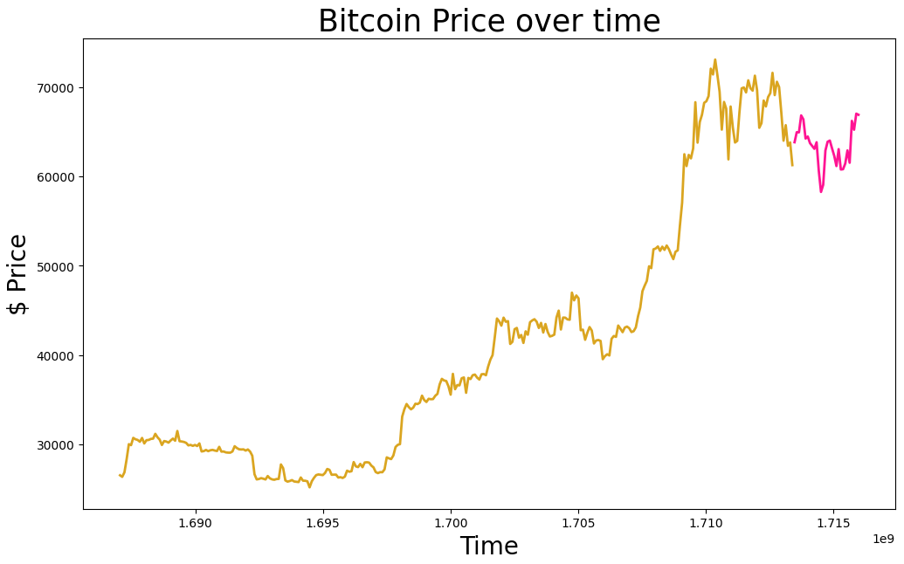

# Crypto Scraping and Analysis Project

This project scrapes historical cryptocurrency data from the CryptoCompare API, stores it in a PostgreSQL database, and performs data analysis and visualization using Python. The project runs within an Anaconda environment using Jupyter Notebook.

## Project Description
This project collects historical price data for selected cryptocurrencies (BTC, ETH, and SOL) from the CryptoCompare API. The data is then converted into a pandas DataFrame, transformed into a suitable format, and saved into a PostgreSQL database. Additionally, the project includes data visualization and linear regression analysis for the Bitcoin data.

## Project Description
This project collects historical price data for selected cryptocurrencies (BTC, ETH, and SOL) from the CryptoCompare API. The data is then converted into a pandas DataFrame, transformed into a suitable format, and saved into a PostgreSQL database. Additionally, the project includes data visualization and linear regression analysis for the Bitcoin data.

## Installation
Prerequisites:
- Anaconda - Anaconda Distribution
- PostgreSQL - PostgreSQL Database
- CryptoCompare API
- VS Code (Optional)

## Setup
1. **Clone the repository:**
```bash
git clone https://github.com/yourusername/crypto-scraping-project.git
cd crypto-scraping-project
```
2. **Create and activate a new Anaconda environment:**
```bash
 conda create -n crypto-scraping python=3.8
 conda activate crypto-scraping
```
3. **Install the required packages:**
```bash
conda install jupyter pandas sqlalchemy requests matplotlib scikit-learn
pip install psycopg2-binary
```

4. **Set up your PostgreSQL database:**
- Make sure your PostgreSQL server is running and create a new database for this project.

## Usage

1. **Update database configuration:**
Open the Jupyter Notebook file and update the database configuration section with your PostgreSQL credentials.
```python
user = 'your_postgres_username'
password = 'your_postgres_password'
host = 'your_postgres_host'
port = 'your_postgres_port'
database = 'your_database_name'
```

2. **Run Jupyter Notebook**
Launch Jupyter Notebook from your terminal:
```bash
jupyter notebook
```
Open the notebook file and run all cells to scrape the data, save it to your PostgreSQL database, and perform data analysis and visualization.

## Data Scraping and Storage
The script scrapes data for the following cryptocurrencies:
- Bitcoin (BTC)
- Ethereum (ETH)
- Solana (SOL)

You can modify the list of cryptocurrencies by editing the coins list in the script:
```bash
coins = ["BTC", "ETH", "SOL"]
```

You can also adjust the number of days of historical data by changing the days variable:
```bash
days = "35"
```

## Data Analysis and Visualization
The project includes a Jupyter Notebook (BTC-LR.ipynb) for analyzing Bitcoin data. The notebook:
1. Loads Bitcoin data from a CSV file.
2. Visualizes the Bitcoin price over time.
3. Prepares the data for linear regression analysis.
4. Fits a linear regression model to the data.

## Results (BTC Example)

Pink represents the prediction of the prices of Bitcoin


   

